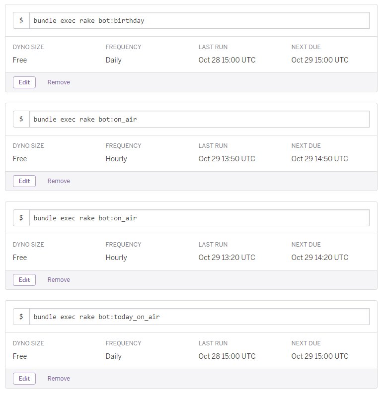

# cure-mastodon-bots
Precure mastodon bot

* https://precure.ml/@precure_birthday_bot
* https://precure.ml/@precure_onair_bot
* https://cure-mastodon-bots.herokuapp.com/

[](https://circleci.com/gh/sue445/cure-mastodon-bots)
[](https://coveralls.io/github/sue445/cure-mastodon-bots?branch=HEAD)

## Setup
```bash
bundle install
cp .env.example .env
vi .env
```

## Run
```
bundle exec foreman s
```

open http://localhost:3000/

# Heroku
## Setup
```bash
heroku config:set MASTODON_URL=https://precure.ml
heroku config:set RACK_ENV=production
heroku config:set ACCESS_TOKEN_SAMPLE=xxxxxxxxx
heroku config:set ACCESS_TOKEN_BIRTHDAY=xxxxxxxxx
heroku config:set ACCESS_TOKEN_ON_AIR=xxxxxxxxx
heroku config:add ROLLBAR_ACCESS_TOKEN=xxxxxxxxx
```

## Scheduler
Register rake tasks to [Heroku Scheduler](https://addons.heroku.com/scheduler)



tasks

* `bundle exec rake bot:birthday`
* `bundle exec rake bot:on_air`
* `bundle exec rake bot:today_on_air`

## Deploy to Heroku
[](https://heroku.com/deploy)
